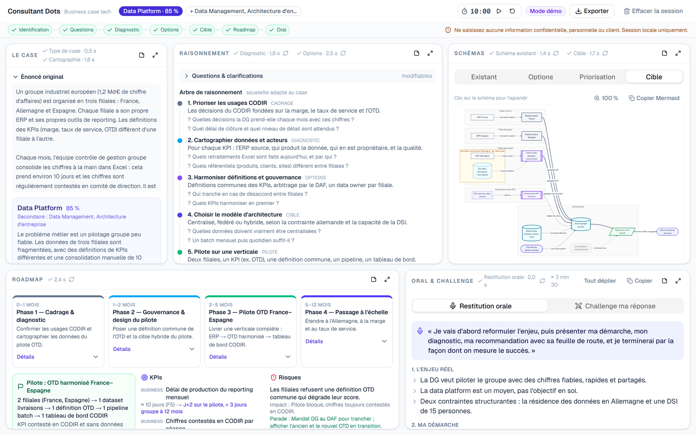
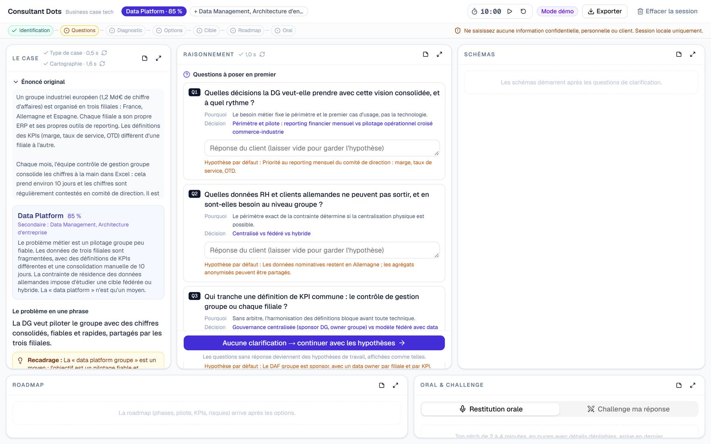
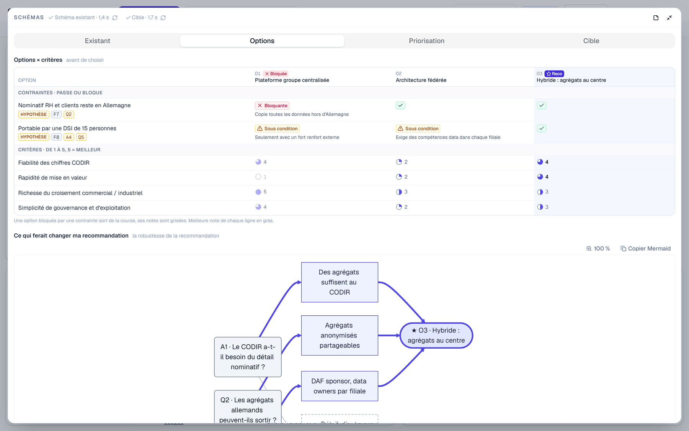
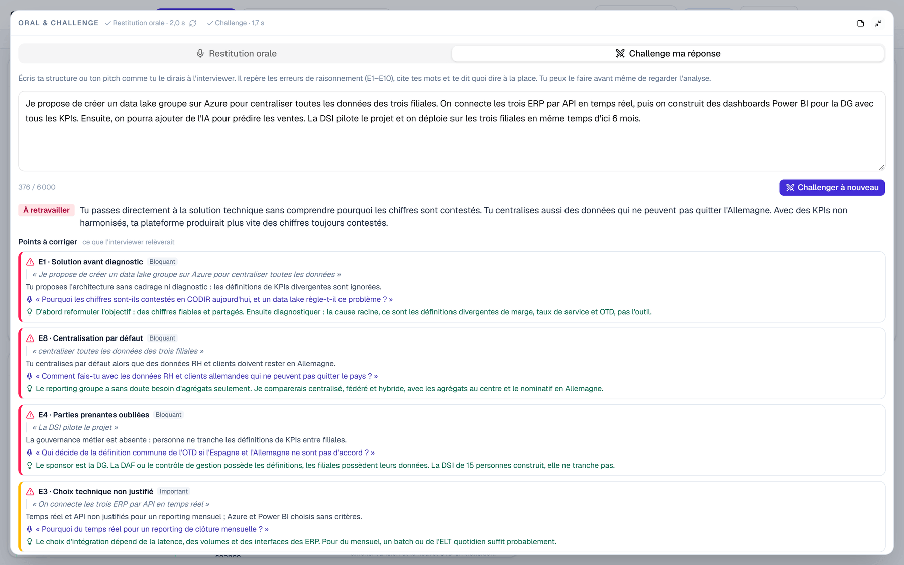
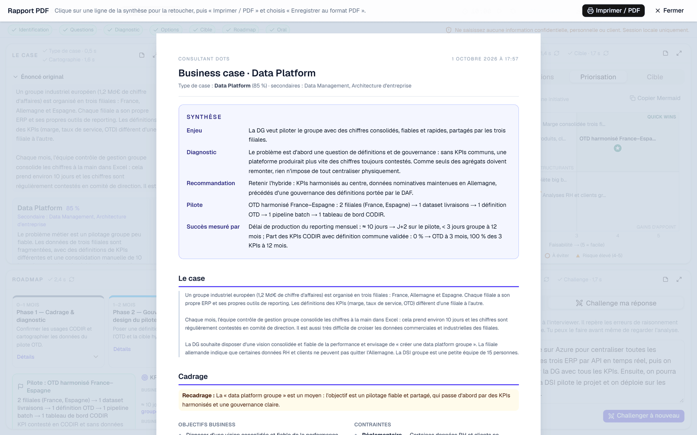
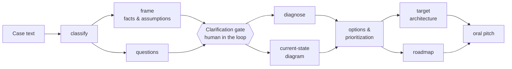

# Consultant Dots

[](https://github.com/spykernv/consultant-dots/actions/workflows/ci.yml)


**A multi-stage LLM pipeline that connects the dots of a tech-consulting business case: it turns a raw case into a structured, sourced answer, and it asks its clarifying questions before it solves anything.**

You paste a case. Nine typed model calls later (about 1.5 minutes in my runs), you get:
- a framing that keeps verified facts apart from assumptions;
- a diagnosis;
- options checked against hard constraints;
- a prioritized pilot;
- a target architecture;
- a roadmap with KPIs;
- a 2–4 minute oral pitch.

A *challenge* mode then critiques your own answer like a demanding interviewer and quotes your exact words.

**What makes it more than a prompt**
- **A typed contract per stage.** Each stage is a Zod schema compiled to a strict JSON Schema that the model must fill. The result is validated again before use. ([strict-schema.ts](src/lib/schemas/strict-schema.ts), [run-stage.ts](src/lib/pipeline/run-stage.ts))
- **Grounding checked in code.** Every "fact" must quote the case. A Unicode-aware matcher checks the quote, and anything it cannot find is demoted to an assumption. ([brief.ts](src/lib/prompts/brief.ts), [normalize.ts](src/lib/pipeline/normalize.ts))
- **A human-in-the-loop gate.** The stage graph stops after the clarifying questions. Nothing downstream runs until you answer them or accept their default assumptions. ([machine.ts](src/lib/store/machine.ts))
- **The model describes, the code renders.** Diagrams are typed graphs compiled to Mermaid, and the value × feasibility ranking is computed, not generated. ([to-mermaid.ts](src/lib/diagram/to-mermaid.ts), [priority.ts](src/lib/diagram/priority.ts))
- **Runs without an account.** A replay engine streams recorded real runs, so the demo and CI need no login and no API key. ([mock.ts](src/lib/engine/mock.ts))

**Try the demo without any account:** `npm install && npm run dev`, open http://127.0.0.1:3000 and click **« Démo sans IA »**.



> [!NOTE]
> The UI and the generated content are in French (I built it to practise French-speaking case interviews). The prompt instructions, the schemas and the code are in English; the case brief inside the prompt is in French.

## Why I built it

A chatbot faced with a business case gives you a wall of text that jumps straight to the solution: "build a data lake", "add AI". Good consultants do the opposite:
- they reframe the business problem;
- they keep what they know apart from what they assume;
- they ask before they solve;
- they compare options against real constraints;
- they start with a realistic pilot and say how success will be measured.

I wanted a tool that **enforces that discipline instead of just generating prose**. That meant treating the LLM as one component of a pipeline:
- typed outputs;
- grounding checks done in code;
- a human decision point;
- deterministic post-processing;
- tests around all of it.

The same discipline is what a good technical discovery looks like: ask before you solve, write down what you are assuming, and start with a pilot whose success you can measure.

## What it does

| Step | What you get |
|---|---|
| **Classify** | Case type among 12 domains plus "other" (data platform, GenAI, cloud, enterprise architecture, M&A IT…). The primary domain selects one of 10 domain playbooks, or a universal one for "other". Up to two secondary domains add a condensed version of theirs |
| **Frame** | Business goals, pain points, constraints, stakeholders. **Facts** quote the case verbatim; anything that cannot be verified becomes an **assumption** |
| **Clarify** *(human gate)* | 3–5 questions, each with why it matters, the decision it unlocks and a default working assumption. Nothing is solved until you answer or skip |
| **Diagnose** | Reasoning tree, root causes and a key insight. Findings cite the ids they rest on (`F#` fact, `A#` assumption, `Q#` clarification: client answer or working assumption, `C#` client note); ids that do not exist are dropped |
| **Current state** | An architecture diagram generated as a typed graph and compiled to Mermaid |
| **Options** | Options × criteria matrix. Hard constraints pass, pass under condition or block, with their source. A "what would change my recommendation" decision tree |
| **Prioritize** | Editable value × feasibility matrix with weights and a pilot choice, computed in the browser without another model call |
| **Target & roadmap** | Target architecture, phased roadmap, pilot scope, KPIs with a baseline and a target, risks with mitigations |
| **Oral pitch** | A 2–4 minute structured restitution |
| **Challenge** | An interviewer critique of *your* answer. Each issue is tied to one of 10 consulting "reflexes" (E1–E10). It quotes your exact words when the issue is in the text (quotes are verified in code; omissions carry none), and comes with the follow-up question and a better phrasing |
| **Export** | Full Markdown, `.mmd` diagrams, and a print-ready report (saved as PDF from the browser's print dialog) that opens with an editable 5-line synthesis |

<table>
<tr>
<td width="50%"><br><sub><b>Human-in-the-loop gate.</b> The analysis waits for the client's answers. Unanswered questions become explicit working assumptions.</sub></td>
<td width="50%"><br><sub><b>Options vs constraints.</b> A blocking constraint (sourced to a fact or an assumption) takes an option out of the running. The decision tree shows what would flip the recommendation.</sub></td>
</tr>
<tr>
<td width="50%"><br><sub><b>Challenge mode.</b> The critique quotes the answer verbatim; quotes are checked in code and dropped if they are not in the text.</sub></td>
<td width="50%"><br><sub><b>Report.</b> An editable 5-line synthesis (stake, diagnosis, recommendation, pilot, success metrics), then the full analysis.</sub></td>
</tr>
</table>

## How it works



Each stage box (everything except the case text and the gate) is one model call with its own schema, prompt and reasoning effort; the prioritization is then computed in the browser.

The stages run in **parallel waves**, with at most 3 calls at once and a 150 s timeout each:
- two waves reach the questions: classify, then frame and questions;
- four more finish the analysis: diagnose and current state, options, target and roadmap, then the oral pitch.

In my runs with the default model and effort settings, the questions appear after about 15 s and the full analysis takes about 1.5 min.

The request path:

```
Browser (zustand state machine)
  └─ POST /api/stage/:stage ──────────── NDJSON stream: status · partial JSON deltas · done | error
       └─ run-stage: validate inputs (zod) → build prompt (playbook + brief + step + revision)
            └─ engine: Claude Code headless (claude -p)  |  mock (replays recorded runs)
                 └─ structured output (strict JSON Schema) → zod parse → normalize (grounding) → done
```

The model's output is treated as untrusted input until it has passed Zod and the normalizer.

## Design decisions and lessons learned

- **Verify in code what the model cannot be trusted to self-report.** A model asked to cite its sources sometimes cites them a little loosely. Checking the quotes deterministically and demoting what fails gives a FACT badge that means something precise: the quote is in the case.
- **State decisions explicitly; don't just pass data.** When the user overrides the model's pilot, sending the updated matrix was not enough: the model followed its own earlier recommendation text. The fix has two parts: an explicit `<candidate_decision>` block in the prompt, and enforcement in post-processing.
- **Let the model describe and let the code render.** The model fills a typed graph and the code compiles it to Mermaid, so the model never writes diagram syntax. The value × feasibility chart is pure computation, so it updates instantly when the user edits the matrix.
- **Staleness is a product feature.** Hashing each stage's inputs, reduced to the changes that matter, tells the user which sections no longer match their latest input, without re-running everything.
- **A replay engine pays for itself.** Recorded runs gave a free demo, fast deterministic tests and a contract check for every schema change. They do not replace live evals: a replayed output cannot regress when a prompt changes.

## Engineering highlights

### Structured outputs, end to end
- Each stage is defined once as a **Zod schema**. It is converted to a **strict JSON Schema**:
  - every object is closed (`additionalProperties: false`) and every property is required;
  - keywords that structured output does not enforce are removed (`default`, numeric bounds, lengths, patterns, `maxItems`).

  Expected counts live in the field descriptions, and lists are capped in post-processing. The schema is passed to the model as its output contract, and the server validates the result again with Zod before using it.
- The output **streams as partial JSON** and renders live. Numbers stay hidden until complete, so a confidence of 85 % never flashes as 8 %.

### Grounding checks
- **The code checks every fact, not the model.** A fact must carry a verbatim quote from the case. A Unicode-aware matcher checks it:
  - it tolerates elisions, re-typed quotation marks, ligatures and PDF copy artifacts;
  - it stays strict on word boundaries, order, numbers and signs.

  A fact that cannot be verified is demoted to an assumption, and the UI says why.
- **What the check does not prove.** It proves that the quoted words appear in the case, in order. It does not prove that the quote supports the paraphrased fact, and an elided quote stitched from distant fragments can still pass. Checking support would take a second, model-graded pass.
- **Sources are typed and checked.** Model-provided ids are renumbered, and every `F#/A#/Q#/C#` reference is filtered against the ids that actually exist. The FACT / CLIENT / ASSUMPTION badges are derived in code.
- **Diagrams are compiled, not generated.** The model never writes Mermaid. It describes a typed graph (actors, systems, data, pain points, "stays local" boundaries), and a compiler turns it into Mermaid with escaping and fallbacks. CI parses every recorded diagram with Mermaid's own parser.

### Prompt architecture
- **A shared prompt prefix.** The system prompt never changes between calls, and the `<case>` block follows it, so every stage of a case starts with the same prefix. Prompt caching can reuse that layout, but I have not measured cache hits through the CLI. Everything specific to the stage comes after it, in tagged blocks such as `<playbook>`, `<brief>`, `<context>`, `<candidate_decision>` and `<revision>`, followed by the stage's `<step>` instructions.
- **Domain playbooks**: 10 analysis grids selected from the classification, plus a universal fallback.
- **A shared rubric of 10 consulting reflexes (E1–E10)**, such as "solution before diagnosis" or "centralization assumed by default". The same rubric drives both generation and critique.
- **Regeneration with a steer.** Instructions like "more concise" or "more senior" are applied with the previous version as context. The user's own decisions are carried through explicitly.

### Human in the loop and orchestration
- Stages form a **DAG** that runs in parallel waves, with a **clarification gate** before any solving.
- Each result stores a **hash of its stage inputs**, normalized to what should count as a change:
  - when an answer, a client note, a regenerated upstream section or the chosen pilot changes, the downstream sections are flagged out of date and can be refreshed as a cascade;
  - re-sorting or re-scoring the matrix, or reformatting client notes (blank lines, bullets, surrounding spaces), does not trigger a refresh. Target, roadmap and oral pitch track only the initiatives' names and verdicts.
- **User decisions survive regeneration.** The pilot picked in the matrix and the initiatives the user added are sent to the model as decisions and re-applied after the run. When an explicit instruction leads the model to another pilot, or the chosen pilot no longer exists, the app keeps the model's pilot and says so.

### Engine
- The default engine runs the **Claude Code CLI headless** (`claude -p`) as a managed child process:
  - structured output through `--json-schema` and a streamed event output;
  - **no tools**, safe mode, no session persistence;
  - reasoning effort set per stage, a fallback model, a concurrency limit and a timeout;
  - on abort or timeout it kills the whole process tree on Windows (`taskkill /T /F`) and sends `SIGTERM` to the child elsewhere;
  - typed error mapping for auth, rate limit and overload.
- A **mock engine** replays recorded real runs. It powers the demo without any account or API key, and the same recordings feed the tests. Both engines take the same `EngineRequest` and return the same `EngineResult` ([types.ts](src/lib/engine/types.ts)), so a direct API client would be one more function and one more branch in `run-stage.ts`.

## Evaluation

What is checked today, and what is not yet.

| Layer | What is checked | When | Code |
|---|---|---|---|
| Output contract | The model fills a strict JSON Schema; the result must also parse against the stage's Zod schema, or the stage fails | Every live run | [run-stage.ts](src/lib/pipeline/run-stage.ts) |
| Grounding | Each fact's quote must be found in the case (word order, word boundaries, numbers and signs kept). A fact that fails is demoted to an assumption and reported | Every live run | [brief.ts](src/lib/prompts/brief.ts), [normalize.ts](src/lib/pipeline/normalize.ts) |
| Citations | `F#/A#/Q#/C#` references to ids that do not exist are dropped. FACT / CLIENT / ASSUMPTION badges are derived from what remains | Every live run | [normalize.ts](src/lib/pipeline/normalize.ts) |
| Business rules | Exactly one pilot. A recommended option that fails a hard constraint is flagged. Challenge quotes not found in your answer are removed | Every live run | [normalize.ts](src/lib/pipeline/normalize.ts) |
| Contract tests | Every recorded output still parses against today's schemas. Every recorded diagram compiles and passes Mermaid's own parser | CI | [fixtures.test.ts](tests/fixtures.test.ts), [to-mermaid.test.ts](tests/to-mermaid.test.ts) |
| Unit tests | Matcher edge cases (elisions, PDF artifacts, signs), normalization, prompt construction, staleness, orchestration, persistence | CI | [tests/](tests) |

**Not measured yet: answer quality across prompt or model changes.** The recorded runs are replayed, not regenerated, so they catch code regressions, not prompt regressions. The eval I would add next:
- **Code-graded rates on live runs:** the share of facts whose quote verifies, citations dropped, schema failures, and recommendations that break a hard constraint. The normalizer already reports demoted facts, removed quotes and constraint conflicts; they only need to be stored and aggregated.
- **Planted errors as labels:** each sample case ships a deliberately flawed answer. Labelling which reflexes (E1–E10) it violates turns challenge mode into a precision / recall test.
- **Rubric grading:** a model grader applies the same E1–E10 rubric to the generated recommendation, checked against a few runs I grade by hand.
- **Repeated runs:** several samples per case and per prompt version, so that a real change can be told apart from run-to-run variance.

### Tests and CI
- **About 190 Vitest tests**, some parametrized over every stage and every recorded output.
- GitHub Actions runs the typecheck, lint, tests and production build on every push.

### Local-first and safe by default
- The server binds to `127.0.0.1`. The API checks the `Host` header (against DNS rebinding) and the `Origin` and `Sec-Fetch-Site` headers. It also requires a JSON content type on requests that carry a body. Other websites therefore cannot drive it.
- Input sizes are capped and case ids are validated. In subscription mode, provider API keys and auth tokens are removed from the CLI's environment.
- Every case **autosaves to disk** with optimistic concurrency: two tabs never silently overwrite each other, and a stale tab cannot bring back a deleted case.

## Design notes: a direct API engine

The CLI engine let me run everything on my own account with no key to manage. A direct API client would implement the same `EngineRequest → EngineResult` contract. What I would do with it:
- **Keep the streaming protocol.** The CLI already forwards the model's raw stream events (`content_block_delta` with `input_json_delta`), so the NDJSON protocol and the UI would not change.
- **Cache the shared prefix on purpose.** Every stage of a case starts with the same system prompt and `<case>` block. An explicit cache breakpoint after them, plus logging of the cached input tokens, would turn "cache-friendly" into a measured saving.
- **Repair instead of failing.** Today, an output that still fails Zod validation ends the stage, and the user retries by hand. One automatic retry that sends the Zod issues back is cheap.
- **Run evals in batch.** Eval runs (cases × samples × prompt versions) are not latency-sensitive, so they belong on a batch endpoint.
- **Keep the analysis a fixed graph.** The analysis stages do not need an agent loop: a fixed DAG keeps cost, latency and tests predictable. The planned conversational interviewer is where a loop with tools would help, for example a tool that checks a quote or looks up fact F3.

## Getting started

Requires **Node 24+**.

```bash
npm install
npm run dev
```

Open http://127.0.0.1:3000 and click **« Démo sans IA »**: the whole pipeline replays recorded runs, with no AI account needed.

To analyse your own cases, install the **Claude Code CLI**, then run `claude` and `/login` once. The page checks the CLI (`claude --version`) and its login status (`claude auth status`) when it loads and after each finished stage; the badge at the top right shows the result. Each stage runs on your own Claude login, and a full case takes 9 model calls.

### Configuration (`.env.local`, all optional)

| Variable | Default | Purpose |
|---|---|---|
| `CONSULTANT_DOTS_MODEL` | `claude-opus-5-5` | Model used for every stage |
| `CONSULTANT_DOTS_FALLBACK_MODEL` | `claude-opus-5` | Used when the main model is overloaded |
| `CONSULTANT_DOTS_CLAUDE_BIN` | auto-detected | Full path to the `claude` executable |
| `CONSULTANT_DOTS_CLAUDE_AUTH` | `subscription` | `subscription` removes API-key and auth-token variables from the CLI's environment, so your Claude login is used; `inherit` passes the environment through |
| `CONSULTANT_DOTS_RECORD_FIXTURES` | `0` | `1` records the outputs for the built-in sample cases into `fixtures/mock/` |
| `CONSULTANT_DOTS_CASES_DIR` | `cases/` | Where cases are saved, one folder per case |

The reasoning effort per stage is set in `src/lib/engine/config.ts`.

### Scripts

| Command | Purpose |
|---|---|
| `npm run dev` | Development server on 127.0.0.1:3000 |
| `npm run build` / `npm start` | Production build and server |
| `npm test` | Test suite |
| `npm run typecheck` / `npm run lint` | TypeScript and ESLint |

## Project structure

```
src/lib/schemas/     Zod schema per stage (types, strict JSON Schema for the model, validation)
src/lib/prompts/     system prompt, per-stage instructions, case brief (F/A/Q/C ids, quote matching)
src/lib/playbooks/   10 domain analysis playbooks + a universal fallback
src/lib/engine/      Claude Code bridge (process, stream parsing, errors) and mock engine
src/lib/pipeline/    server-side stage runner and normalization (grounding, id checks)
src/lib/store/       client state machine, orchestrator, autosave, matrix carry-over
src/lib/diagram/     typed graph → Mermaid compiler, decision tree, value × feasibility placement
src/lib/export/      Markdown, Mermaid and report exports
src/components/      five-zone workspace (case, reasoning, diagrams, roadmap, oral & challenge), decision diagrams, report preview
fixtures/mock/       recorded real runs for the three sample cases (the demo replays the first; all three feed the tests)
tests/               Vitest suite
```

## Roadmap

- Whiteboard view (current state | problems | target | roadmap) with PNG export
- The evaluation layer described above
- Training mode with scoring over several cases
- Conversational mock interviewer
- English UI

## Privacy

The app runs locally: a Next.js server on 127.0.0.1, with no database and no hosted backend. Cases are saved under `cases/`, and deleted ones move to `cases/_corbeille/`; git ignores both. The case text and the analysis are sent to the model through your Claude login, so do not paste confidential, personal or client information. This is a personal tool; it is not meant to be exposed as a shared service.

## License

[MIT](LICENSE)
